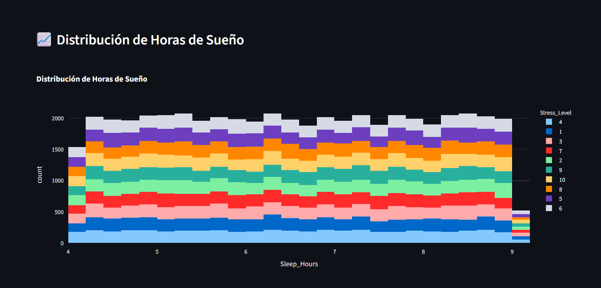
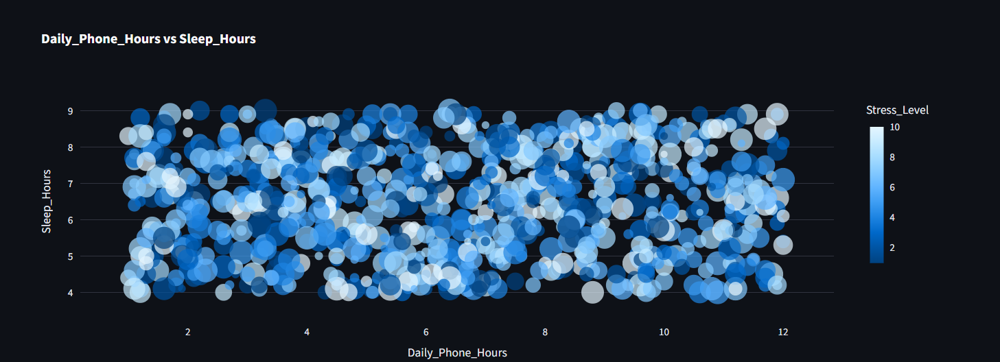

# Sleep Project - Sprint 7

Aplicación interactiva desarrollada con Streamlit para analizar la relación entre el uso de dispositivos digitales, hábitos diarios y patrones de sueño.

**Aplicación en producción:**  
https://sleep-project.onrender.com/

---

## 1. Objetivo del análisis

El objetivo de este proyecto es analizar cómo el uso de dispositivos digitales y el tiempo frente a pantallas se relacionan con:

- Horas de sueño  
- Nivel de estrés  
- Productividad laboral  
- Consumo de cafeína  
- Hábitos digitales durante el fin de semana  

A través de un dashboard interactivo se busca:

- Explorar patrones de comportamiento digital.
- Identificar relaciones entre tiempo de uso del teléfono y descanso.
- Analizar el impacto del uso de redes sociales en el estrés.
- Evaluar la relación entre sueño y productividad laboral.
- Permitir filtrado dinámico de variables para análisis exploratorio.

---

## 2. Descripción del Dataset

El dataset contiene:

- 50.000 registros
- 13 variables
- Sin valores nulos

### Estructura del DataFrame

- RangeIndex: 50000 entries (0 a 49999)
- Total columnas: 13
- Valores no nulos: 50000 en todas las columnas

### Variables incluidas

| Variable | Tipo | Descripción |
|-----------|--------|-------------|
| User_ID | object | Identificador único del usuario |
| Age | int64 | Edad del usuario |
| Gender | object | Género |
| Occupation | object | Ocupación |
| Device_Type | object | Tipo de dispositivo utilizado |
| Daily_Phone_Hours | float64 | Horas promedio diarias de uso del teléfono |
| Social_Media_Hours | float64 | Horas promedio diarias en redes sociales |
| Work_Productivity_Score | int64 | Puntaje de productividad laboral |
| Sleep_Hours | float64 | Horas promedio de sueño |
| Stress_Level | int64 | Nivel de estrés |
| App_Usage_Count | int64 | Cantidad de aplicaciones utilizadas |
| Caffeine_Intake_Cups | int64 | Tazas de cafeína consumidas por día |
| Weekend_Screen_Time_Hours | float64 | Horas de pantalla durante el fin de semana |

---

## 3. Tecnologías Utilizadas

- Python
- Pandas (manipulación y análisis de datos)
- Plotly (visualizaciones interactivas)
- Streamlit (desarrollo del dashboard web)
- Render (despliegue en la nube)

---

## 4. Estructura del Proyecto

sleep-project/
    -app.py
    -.gitignore
    -requirements.txt
    -sleepdata.csv
    -README.md
    -sleep_env/
    -notebooks/
        -EDA.ipynb
    -images/
        -dashboard_overview.png
        -sleep_vs_phone.png

## 5. Instrucciones para Ejecutar la App Localmente

### 1. Clonar el repositorio

git clone https://github.com/tu-usuario/sleep-project.git
cd sleep-project

### 2. Instalar dependencias
pip install -r requirements.txt

### 3. Ejecutar la aplicación
streamlit run app.py

### 4. La aplicación se abrirá en:
http://localhost:8501

## 6. Dashboard en Producción

La aplicación está desplegada en Render y puede visualizarse en:
https://sleep-project.onrender.com/

## 7. Visualizaciones Incluidas

El dashboard incluye las siguientes visualizaciones interactivas desarrolladas con Plotly:

- Distribución de horas de sueño.
- Relación entre uso diario del teléfono y horas de descanso.
- Impacto del tiempo en redes sociales sobre el nivel de estrés.
- Relación entre consumo de cafeína y duración del sueño.
- Comparación del tiempo de pantalla entre semana y fin de semana.
- Análisis de productividad laboral según hábitos digitales.

Todas las visualizaciones permiten interacción dinámica, filtrado y exploración de datos en tiempo real.

---

## 8. Capturas del Dashboard

---

## 9. Principales Hallazgos

A partir del análisis exploratorio de los datos se identificaron los siguientes patrones:

- Existe una relación entre mayor uso diario del teléfono y menor cantidad de horas de sueño.
- El aumento en horas dedicadas a redes sociales se asocia con niveles más altos de estrés.
- El consumo de cafeína muestra un impacto negativo en la duración del descanso.
- El uso excesivo de pantalla durante el fin de semana presenta variaciones en los patrones de sueño.
- La productividad laboral evidencia relación con la calidad y cantidad de horas de descanso.

Estos hallazgos permiten comprender mejor la interacción entre hábitos digitales, descanso y bienestar general.

---

## 10. Conclusión

Este proyecto demuestra cómo los hábitos digitales pueden influir en el bienestar y desempeño laboral.

La combinación de análisis exploratorio y visualización interactiva permite:

- Detectar patrones relevantes.
- Identificar posibles relaciones entre variables.
- Facilitar la interpretación de datos complejos.
- Generar insights basados en evidencia.

El uso de Streamlit, Pandas y Plotly permitió desarrollar una aplicación accesible, interactiva y escalable para el análisis de comportamiento digital y sueño.

---
